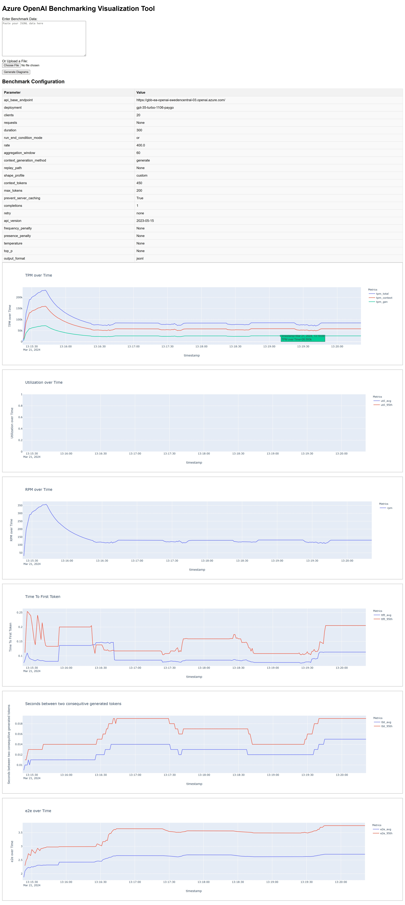

# Azure OpenAI Benchmark result Visualization Tool

This Flask application visualizes the JSONL result of [azure-openai-benchmark](https://github.com/Azure/azure-openai-benchmark) using Plotly, providing interactive and dynamic charts for data analysis.

## Screeshot


## Features

- **Data Cleansing**: Processes and cleans JSONL data for visualization.
- **Plotly Visualizations**: Generates interactive line charts for various metrics over time.
- **Dynamic Data Input**: Supports both text input and file upload for data.


## Usage

1. Install the required python libs with `pip install -r requirements.txt`
2. Run the Flask app with `python app.py`.
3. Navigate to the application URL, usually `http://127.0.0.1:5000/`.
4. Upload your JSONL data file or paste the JSONL content directly. <strong style="color: red;">You need to set the output format of the benchmark tool to jsonl</strong> with option "--output-format jsonl", example below:
   ```shell
   python3 -m benchmark.bench load \
    --deployment gpt-35-turbo-1106 \
    --rate 6 \
    --output-format jsonl \
    --duration 300 \
    --log-save-dir ./logs \
    https://gbb-ea-openai-swedencentral-03.openai.azure.com
    ```

5. Enter the raw json data in input box or upload the jsonl file to view the visualizations.

## Requirements

- Flask
- Pandas
- Plotly
- gunicorn

## Installation

Install the required packages using pip:

```
pip install -r requirements.txt
```

## Example Data Format

The application expects JSONL data where each line is a valid JSON object. Example:

```
{"run_seconds": 1, "timestamp": "2024-01-31 08:50:31", "rpm": 13.0, "processing": 8, "completed": 13, "failures": 0, "throttled": 0, "requests": 13, "tpm": {"context": 5392.0, "gen": 651.0, "total": 6043.0}, "e2e": {"avg": 0.505, "95th": 0.732}, "ttft": {"avg": 0.144, "95th": 0.298}, "tbt": {"avg": 0.007, "95th": 0.008}, "context_tpr_avg": 414, "gen_tpr": {"10th": 35, "avg": 50, "90th": 60}, "util": {"avg": "7.2%", "95th": "12.4%"}}
{"run_seconds": 2, "timestamp": "2024-01-31 08:50:32", "rpm": 30.0, "processing": 11, "completed": 30, "failures": 0, "throttled": 0, "requests": 30, "tpm": {"context": 12473.0, "gen": 1562.0, "total": 14035.0}, "e2e": {"avg": 0.482, "95th": 0.648}, "ttft": {"avg": 0.108, "95th": 0.218}, "tbt": {"avg": 0.007, "95th": 0.009}, "context_tpr_avg": 415, "gen_tpr": {"10th": 37, "avg": 52, "90th": 64}, "util": {"avg": "9.4%", "95th": "13.2%"}}
{"run_seconds": 3, "timestamp": "2024-01-31 08:50:33", "rpm": 52.0, "processing": 9, "completed": 52, "failures": 0, "throttled": 0, "requests": 52, "tpm": {"context": 21272.0, "gen": 2705.0, "total": 23977.0}, "e2e": {"avg": 0.466, "95th": 0.687}, "ttft": {"avg": 0.1, "95th": 0.207}, "tbt": {"avg": 0.007, "95th": 0.008}, "context_tpr_avg": 409, "gen_tpr": {"10th": 38, "avg": 52, "90th": 64}, "util": {"avg": "10.3%", "95th": "13.4%"}}
```

## Contributing

Feel free to fork the repository, make improvements, and submit a pull request. We appreciate your contributions to make this tool better.
